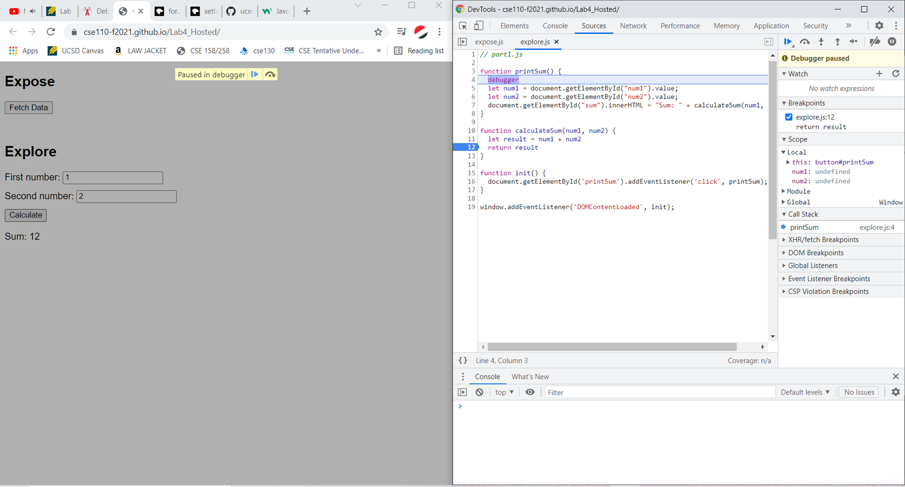

### Steven Shoemaker
### CSE 110 Lab 4 - Part 3 (explore)

1. The `value` property of an input text box returns a String, not a Number. We examined pretty thoroughly in the expose section that the + operator between two strings just concatenates them. Therefore, this program is just outputting the concatenation of two strings, not the sum of the numbers they represent.

2. It's an easy fix - because the expected input to these text boxes should be numbers, the `Number(value)` constructor in JavaScript should convert the strings to numbers no problem. We first cast the Strings to Numbers, THEN find and return their sum.

All images can also be found in explore/devtools

> Result - calculate sum

> Result - data type

> Fix
